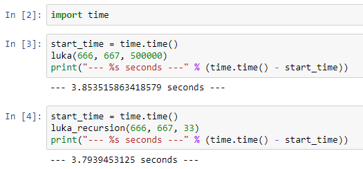
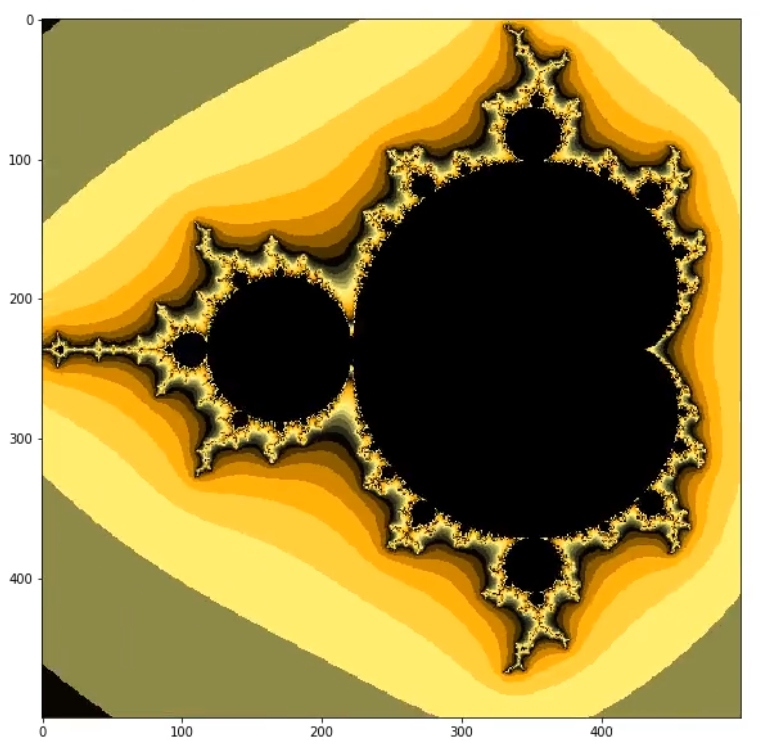

### Мои Jupyter Notebooks

Изучаем

- NumPy
- Pandas
- Numba
- модули `itertools`, `functools` & `statistics`
- способы измерения размеров объектов с помощью `pympler.asizeof`, `sys.getsizeof`
- строим красивые графики 

и всё такое

***

