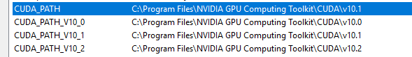

### Изучаем TensorFlow 2

#### Часть 1. Установка tensorflow-gpu и зависимостей

NB 1: TensorFlow 2.3 требует **CUDA 10.1 и CuDNN 8.0.4.30**

- Скачиваем `CUDA Toolkit` нужной версии с официального сайта [NVidia](https://developer.nvidia.com/cuda-toolkit-archive).
При установке выбираем пункты:

        Runtime, 
        Development, 
        Driver & Audio Driver.
        
    Документация, примеры, плагины для интеграции с Visual Studio не нужны.
    Путь установки по умолчанию это `C:\Program Files\NVIDIA GPU Computing Toolkit\CUDA\v10.1`. 
    
    Одновременно может быть установлено сразу несколько версий библиотек (но не драйверов ОС). 
    В этом случае стоит проверить правильность путей в переменных среды.
    
    
    `CUDA_PATH` будет указывать на последнюю установленную версию. 
    

- Скчачиваем `CuDNN` с офф. сайта (потребуется регистрация на NVidia Developers). Распаковываем файлы из
    + `bin` в `bin`,
    + `include` в `include`,
    + `lib` в `lib` 

нужной версии `CUDA Toolkit`.

- Обновим Анаконду: 

        conda update conda
        conda update anaconda
        conda update anaconda-navigator
        conda update --all

- Создадим среду окружения: `conda create --n tf-2-gpu_23`
- Активируем её: `conda.bat activate tf-2-gpu_23` (`conda deactivate` для выключения)
- Обновляем пакетный менеджер `pip install --upgrade pip`
- Устанавливаем свежую версию с помощью pip: `pip install tensorflow-gpu`
- [Связывание нового виртуального окружения с юпитер ноутбуком](https://stackoverflow.com/questions/39604271/conda-environments-not-showing-up-in-jupyter-notebook): 
		- `conda install nb_conda`
		- `conda install nb_conda_kernels`
		- Обязательно деактивировать и снова активировать среду окружения
		
- Ставим остальное сами при необходимости
	- `conda install matplotlib`
	
`python test_single_gpu.py`

#### Часть 2. Использование

- Запускаем из консоли `jupyter notebook` или из cnd-файла с содержимым `activate tf-2-gpu && jupyter notebook`
- В самом ноутбуке нужно выбрать ядро: `Kernel -> Change kernel -> Python[conda env: tf-2-gpu_23]`

- Запуск `tensorboard`:

        %load_ext tensorboard
        %tensorboard --logdir logs

#### Часть 3. Совместимость с v1

- Для примеров из книги Шакла Нишант "Машинное обучение и TensorFlow" потребуется использование версии 1:
https://stackoverflow.com/questions/37383812/tensorflow-module-object-has-no-attribute-placeholder

If you have this error
 
     Traceback (most recent call last):
      File "/home/willim/PycharmProjects/tensorflow/tensorflow.py", line 2, in <module>
        import tensorflow as tf
      File "/home/willim/PycharmProjects/tensorflow/tensorflow.py", line 53, in <module>
        tf_in = tf.placeholder("float", [None, A]) # Features
    AttributeError: 'module' object has no attribute 'placeholder'
  
after an upgrade to TensorFlow 2.0, you can still use 1.X API by replacing:

    import tensorflow as tf
by

    import tensorflow.compat.v1 as tf
    tf.disable_v2_behavior()

#### Заметки

- Для v1 можно ограничить потребление видеопамяти:

    gpu_options = tf.GPUOptions(per_process_gpu_memory_fraction=0.2)
    sess = tf.Session(config=tf.ConfigProto(gpu_options=gpu_options))
    
- Скачанные с помощью `keras` dataset'ы хранятся в `C:/users/<username>/.keras/datasets`
- Узнать все виртуальные среды окружения: `conda info -e`
- Ошибка `Cannot open dynamic lib cudart101.dll`: скопировать её в `<Anaconda-Install-Dir>/envs/<your-env-name>/Libraries/bin`